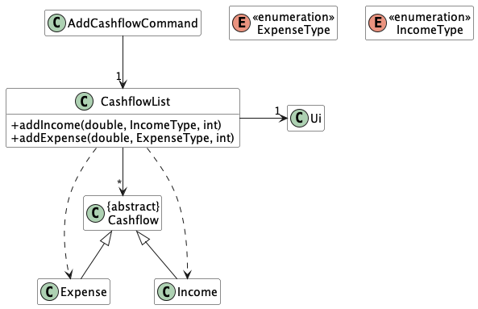

# Developer Guide

## Acknowledgements
- **round() method in Cashflow.java**
  - author: mhadidg
  - source: https://stackoverflow.com/questions/2808535/round-a-double-to-2-decimal-places
- **capitalize() method in Cashflow.java**
  - author: Nick Bolton
  - source: https://stackoverflow.com/questions/1892765/how-to-capitalize-the-first-character-of-each-word-in-a-string

{list here sources of all reused/adapted ideas, code, documentation, and third-party libraries -- include links to the original source as well}

## Design & implementation

{Describe the design and implementation of the product. Use UML diagrams and short code snippets where applicable.}

### Add income/expense feature

The add income/expense command has 2 compulsory arguments `/t` and `/a` and 1 optional argument `/r`.

Example:
```
add income /a 100 /t salary /r 30
```
Below are the steps that shows the implementation of add income/expense.
#### Step 1
An instantiated AddCashflowCommand class gets the instance of CashflowList.

This allows the AddCashflowCommand instance to access the methods of CashflowList.
#### Step 2
The AddCashflowCommand instance then calls addIncome() or addExpense(), depending on what `category` is initialised as.

addIncome() or addExpense() instantiates an Income or Expense object respectively.

Example:
```
switch (category) {
        case INCOME:
            cashflowList.addIncome(amount, incomeType, recur);
            break;
        case EXPENSE:
            cashflowList.addExpense(amount, expenseType, recur);
            break;
        default:
            ui.showMessage("Unidentified entry.");
            break;
        }
```
#### Step 3
The instantiated income/expense then updates the overall balance through addIncomeValue() or addExpenseValue().

The income/expense object is also added to the list in Cashflowlist which contains all incomes/expenses.
#### Step 4
The added income/expense is then displayed to the user through the Ui.

#### Diagrams
Given below is the class diagram showing the class structure of the add income/expense mechanism:


Given below is the sequence diagram showing the add income/expense mechanism:


## Product scope
### Target user profile

{Describe the target user profile}

### Value proposition

{Describe the value proposition: what problem does it solve?}

## User Stories

|Version| As a ... | I want to ... | So that I can ...|
|--------|----------|---------------|------------------|
|v1.0|new user|see usage instructions|refer to them when I forget how to use the application|
|v2.0|user|find a to-do item by name|locate a to-do without having to go through the entire list|

## Non-Functional Requirements

{Give non-functional requirements}

## Glossary

* *glossary item* - Definition

## Instructions for manual testing

{Give instructions on how to do a manual product testing e.g., how to load sample data to be used for testing}
